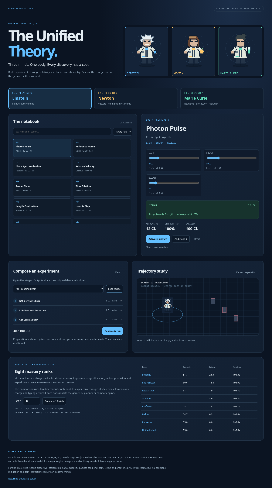

# The Unified Theory

Einstein, Newton and Marie Curie share one champion: one body, health pool, inventory, action queue and charge pool. All **75 skills** are available at every mastery rank. The athlete chooses experiments, writes their symbolic activation recipes and commits their effects.



Open the Database Editor with Mod Manager option **3**, then click **Science Lab** in the top bar. The lab provides every activation recipe and per-token charge, a five-stage experiment builder, 50 templates, charge imbalance feedback, a schematic trajectory preview and deterministic mastery comparisons. [Complete skill catalogue and 50 recipes](unified-theory-catalogue.md).

## Visual identity

The original pixel body has a shared laboratory coat and three distinct persona overlays. Einstein has white hair, a blue tie and a prism; Newton has a brown wig, an amber tie and an apple; Curie has a dark bun, a teal tie and a vial. Scientist changes preserve the same body and collision silhouette. Eight mastery crests appear below the character.

Blue means relativity and light. Amber means vectors and mechanics. Teal means chemistry and radiation. Three notebook rows show the pending recipes; `~` denotes **preferred** token charge. A separate allocation row shows the active stage's **actual total CU** and stability category. Actual per-token allocations appear in the Science Lab and diagnostics. The free-CU meter includes only unreserved charge.

Notebooks refresh every eight ticks and last 0.18 seconds, leaving overlap between refreshes. Native VFX requests are capped at six per caster per update. Field graphics last 1.6 seconds; fields themselves expire on the simulation clock. Personality and rank overlays are persistent named buffs, removed on death.

## Charge and activation

| Rule | Value |
|---|---|
| Shared capacity | 100 CU, stored in hundredths |
| Regeneration | 4 CU/s in combat; 8 CU/s after five seconds without nearby enemies or emitted skill damage |
| Reservation | All stages of the selected experiment reserve charge before preparation |
| Tokens | One every ten ticks, six per second; six ticks to start/switch, twelve ticks to commit |
| Curie's Catalyst | Subsequent chemical tokens take eight ticks, at every mastery rank |
| Partial stage expiry | Eight seconds; switching scientists keeps queued stages |
| Committed calculations | Twenty seconds, tied to the observed target; target changes require fresh calculation |
| Cancellation | Uncommitted stages refund their reserved charge |
| Failed commitment | Current stage is spent; dependent stages cancel and refund |
| Minimum | At least 75% of preferred total; every token costs at least one CU |

For preferred weights `wᵢ`, actual allocations `aᵢ`, and totals `W` and `A`:

```text
expectedᵢ = wᵢ × A / W
error = max(|aᵢ − expectedᵢ| / expectedᵢ)
instability = clamp(round(100 × error + 80 × max(0, A/W − 1.25)), 0, 100)
strength = min(125%, floor(100 × A/W))
```

Rust uses integer fractions; JavaScript uses BigInt. Rounding happens once, halfway upward. Both reproduce the same 375 native vectors.

| Photon Pulse allocation (preferred 4, 5, 3) | Total | Instability | Outcome |
|---|---:|---:|---|
| 4, 5, 3 | 12 | 0 | Stable |
| 5, 6, 4 | 15 | 7 | Stable, 125% strength |
| 4, 8, 3 | 15 | 28 | Strained, small predictable trajectory drift |
| 4, 12, 3 | 19 | 78 | Critical failure |
| 8, 10, 6 | 24 | 60 | Unstable; overcharge cannot exceed 125% strength |

Stable is 0–20; strained is 21–40; unstable is 41–70; critical is 71–100. Unstable attacks receive stronger deterministic lateral drift. Typing mistakes and review also affect commitment. Distillation consumes material to remove ten points of instability from the next chemical cast. Binary preparation actions establish conditions; their geometry is bounded rather than expanded by overcharge.

## What each scientist contributes

**Einstein** establishes coordinate anchors, forecasts motion, bends light through lenses and curved routes, coordinates arrivals and creates bounded spatial control. Photon Pulse is an owned moving packet. Clock Synchronization and Simultaneity align existing packet releases. Proper Time changes owned packet travel speed, while their maximum world lifetime stays fixed. Time Dilation slows movement inside a field and owned packets passing through it. Length Contraction changes the supported circular radius multiplier. Lorentz Step returns toward a live anchor through wall-clipped geometry. Causal Link supplies one conditional short restraint when an owned packet hits. Spacetime Shear divides one allocated attack across enemies in the strip between two anchors. Radiation Pressure adds bounded knockback. Mass–Energy Exchange consumes material for protection. Unified Frame derives routing, timing and prediction from available anchors.

**Newton** creates a coordinate origin and directed vectors, then uses vector addition, dot products, perpendicular vectors, discrete derivatives and bounded forecasts. Dot Product scales its strike by alignment. Momentum Strike spends accumulated momentum and requires close range. Motion generates momentum only from plausible measured movement; teleports do not supply it. Impulse Step follows a prepared vector or retreats when health is low, with wall clipping. Inelastic Collision drains stored momentum and slows the target. Scalar Division and Series Expansion split existing packets while preserving their total payload. Owned packets wait while a reserved manipulation is being written, so they can be manipulated before impact; their original three-second expiry is never extended. Elastic Collision reverses owned trajectories; Boundary Condition enables reflection from live crystals. Centripetal Orbit stores packets around the caster, and Tangential Release sends them along the tangent. Work Integral stores bounded work for later physical allocation, without refilling CU or enlarging the experiment budget. Root Finding places an intersection trigger. Principia prepares a coordinated physical state.

**Curie** maintains a second, smaller resource: eight initial material units, capacity twelve, one replenished every three seconds. Ordinary reactions cost one material; heavy radiation and burst reactions cost two. Sampling establishes analysis. Distillation improves the next chemical commitment at a quantity cost. Titration and Buffer provide measured protection. Acid supplies an allocated corrosive packet and a mild armour penalty; Alkaline, Neutralize and Reduce clear only compatible scientific contamination. Crystal creates a temporary destructible stationary construct. Precipitation Net restrains under prepared conditions. Oxidation combines an allocated dose with reduced healing. Catalyst speeds chemical preparation. Quench removes the caster's compatible reaction fields and salvages at most one material. Stoichiometric Burst rewards a prepared acid/base ratio. Reaction Order staggers divided chemical arrivals. Diffusion Cloud spends the original allocated dose across ticks and targets. Osmotic Draw uses bounded inward force. Membrane supplies capacity-limited protection. Tracer refreshes acquisition; Isotope Label and Half-Life prepare radiation sequencing. Alpha requires close range, Beta divides its original volley, Gamma distributes a penetrating payload, and Decay Chain releases its original dose in three delayed portions.

## Experiments and prerequisites

The 50 recipes are templates, not free extra effects or damage multipliers. Some need a previously prepared anchor, vector, crystal, measurement, sample or isotope. Those casts cost their own CU and material. The bounded planner identifies missing prerequisites and prepares them separately. It waits for charge instead of spending recovery on cheap filler casts that would prevent expensive experiments from starting.

Committed calculations persist for twenty seconds to permit charge recovery before expensive recipes. Live geometry retains its shorter lifetime: anchors sixteen seconds, ordinary fields and crystals six seconds, packets and orbits three seconds. Expired geometry or a lost target can invalidate a commitment. The unfinished notebook still expires after eight seconds. A native integration test starts Grand Experiment from an empty state, pays its real prerequisites, reserves its 96 CU, and reaches Decay Chain.

| Resource / object | Limit |
|---|---:|
| Newton momentum | 100 |
| Curie material | 12 |
| Anchors | 3 |
| Optical lenses | 2 |
| Gravity wells | 1 |
| Chemical fields across net/cloud/osmosis | 2 |
| Destructible crystals | 2 |
| Owned packets, including children | 8 |
| Total active native fields | 12 |
| Planner candidates per evaluation | 32, every six ticks |

Geometry uses integer normalization and bounded forecasts. Enemies must be visible to the team. Minions and summons share the same experiment budget; there is no additional wave-damage pass. The planner prefers protection at low health and attempts longer experiments more reliably at higher mastery. From Scientist rank it prioritizes visible champions over nearby minions; earlier ranks choose the closest target. All ranks can attempt any recipe.

## Damage and control limits

Base stats are 1100 HP, 70 attack, 45 AP, 25 defence, 28 magic resistance, 960 move speed and four HP regeneration. Growth is 120 HP, five attack, eighteen AP, seven defence, seven magic resistance and nine move speed. This champion explicitly receives no extra Mod Power multiplier.

```text
ordinary magic output:   50 + 0.25 AP
ordinary physical output: 50 + 0.25 AD
heavy magic output:     90 + 0.45 AP
heavy physical output:  90 + 0.45 AD
experiment budget: min(sum of allocated offensive outputs, 160 + 0.8 × max(AP, AD))
```

Cast stats are frozen when the experiment starts. Charge strength is applied once. Packet division, piercing, clouds, orbits and decay consume the shared remaining budget. Area attacks share their allocated output across targets. Work can change allocation within the existing budget.

Per caster/target, emitted skill damage is limited to **35% of maximum HP in a rolling two-second window**. Native stuns and forced movement share a limit of sixty ticks within three seconds; forced displacements are limited to two within two seconds. New shields share a three-second issuance limit of 25% of the caster's maximum HP. Named stat buffs refresh rather than stack per caster.

Damage uses the game's normal pipeline for resistance, items, statistics and kill credit. Engine item procs, ordinary attacks and damage from teammates are outside the kit's raw emission guard. Logs record emitted raw damage and observed HP before/after, and report engine kill credit separately.

## Mastery and saved progress

| Rank | Name | Comfortable experiment length |
|---:|---|---:|
| 0 | Student | 1 |
| 1 | Lab Assistant | 1 |
| 2 | Researcher | 2 |
| 3 | Scientist | 2 |
| 4 | Professor | 3 |
| 5 | Fellow | 4 |
| 6 | Laureate | 5 |
| 7 | Unified Mind, Top 10 | 5 |

Mastery uses the existing athlete book and points thresholds: 0, 5, 15, 30, 60, 100, 150, then Top 10 eligibility from 300. Charge jitter decreases from ±40% to ±1%; token-error chances decrease from 12% to 0.1%; review rises from 15% to 100%. Base token speed remains constant. Match snapshots pin progress consistently for server and live simulations. Match results use the existing structure/score record; casting alone does not farm mastery.

Files in `mods/tfm2_custom_ai`: `unified_theory_memory.txt`, `unified_theory_pending.txt`, `unified_theory_history.txt`, `unified_theory_log.txt`, and `unified_theory_damage_log.txt`. Mod Manager option **4 Show logs** includes both diagnostics files. Damage traces buffer sixty-four events, report omissions and rotate at eight MiB with one previous file. Presimulation traces are suppressed without suppressing the watched match.

## Engine boundaries and playtest

The stable API supports owned packet calculations, position changes, named buffs, shields, crowd control, projectile inspection and temporary units. It does not expose mutation or deletion of foreign projectiles. Redshift, Membrane and Projectile Intercept therefore supply protection; they cannot erase or bend an opponent's projectile. Length Contraction uses a circular radius change rather than a directional hitbox. Crystals reflect owned scientific trajectories when Boundary Condition is prepared; general map blocking by their bodies remains an in-game check. Chemical cleanup only recognizes this kit's typed scientific buffs.

The Science Lab validates exact charge/resource math. Its trajectory animation and rank comparison are schematic notebook studies, with no claim of full combat-engine or planner parity. Before balancing from real match results, test low and high mastery, wall clipping, crystal destruction, multi-target Gamma/Decay, engine item interactions, scientist swaps and notebook visibility. See [verification results and remaining game checks](unified-theory-verification.md).
